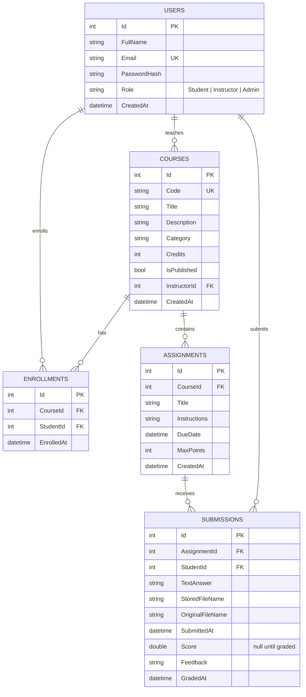

# LearnHub — Design Document

## 1. Objectives → implementation

| # | Project objective | How it is met |
|---|-------------------|---------------|
| 1 | A user-friendly online LMS built with ASP.NET MVC | ASP.NET Core 8 MVC app with a separate dashboard for each role, course catalog, and clear alerts/empty states |
| 2 | User authentication, course management, student enrollment, assignment submission | `AccountController` (register/login/profile), `CoursesController` (CRUD, roster), `Enroll`/`Unenroll` actions, `AssignmentsController.Submit` (text and/or file) and `SubmissionsController.Grade` |
| 3 | Responsive design across devices | Bootstrap 5 grid, collapsible navbar, responsive tables, and extra CSS media queries in `site.css` |
| 4 | Database connectivity for users and courses | EF Core `LmsDbContext` over SQLite (can switch to SQL Server), unique indexes, foreign keys and cascade rules |
| 5 | Code quality, documentation and best practices | Thin controllers with a service layer, view models, DI, async I/O, anti-forgery tokens, XML doc comments, README and this document, and 20 unit tests |

| # | Project task | Where |
|---|--------------|-------|
| 1 | Front end in HTML, CSS, JavaScript | `Views/**`, `wwwroot/css/site.css`, `wwwroot/js/site.js` |
| 2 | Back end with ASP.NET MVC | `Controllers/**`, `Services/**`, `Program.cs` |
| 3 | Authentication and authorization | Cookie auth + roles in `Program.cs`, `[Authorize]` attributes, `LmsService.CanManage` |
| 4 | Database schema + EF connectivity | `Models/Entities.cs`, `Data/LmsDbContext.cs`, `Data/DbSeeder.cs` |
| 5 | Test and debug | `tests/LearnHub.Tests` (xUnit), plus end-to-end checks of every role over HTTP |
| 6 | Demonstrate to stakeholders | Seeded demo data and the demo accounts listed in the README |

## 2. Database schema

**Constraints**

- `Users.Email`, `Courses.Code`, `(CourseId, StudentId)` on Enrollments and `(AssignmentId, StudentId)` on Submissions are all **unique**.
  A student can enroll once per course and has one submission per assignment, which they replace when they resubmit.
- Deleting a **course** cascades to its enrollments and its assignments, and deleting an assignment cascades to its submissions.
- Deleting a **user** is restricted at the database level. `LmsService.DeleteUserAsync` removes a student's rows explicitly. An instructor who still owns courses cannot be deleted.
  Keeping user deletes out of the cascade avoids SQL Server's "multiple cascade paths" error.

## 3. Key business rules (`LmsService`)

| Rule | Enforced in |
|------|-------------|
| Admin accounts cannot self-register; emails are trimmed and lower-cased | `RegisterAsync` |
| Only students can enroll, only in published courses, only once | `EnrollAsync` + unique index |
| Only enrolled students can submit; a submission needs text or a file | `SubmitAsync` |
| A submission can be replaced until it is graded, then it is locked | `SubmitAsync` |
| A submission made after the due date is flagged **Late** | `Submission.IsLate` |
| Only the course's instructor (or an admin) can manage or grade | `CanManage`, `GradeAsync` |
| A score must be between 0 and `MaxPoints`; `MaxPoints` cannot go below an existing grade | `GradeAsync`, `AssignmentsController.Edit` |
| Admins cannot delete themselves or change their own role | `DeleteUserAsync`, `ChangeRoleAsync` |

## 4. Request flow example: submitting an assignment

1. The student opens `GET /Assignments/Details/{id}`. The controller checks enrollment and shows the form. `site.js` rejects files over the size limit before upload.
2. `POST /Assignments/Submit` (multipart). The anti-forgery token is validated and `[Authorize(Roles="Student")]` is enforced.
3. `FileStorageService.Validate` checks the extension and size, then saves the file as `App_Data/uploads/<guid>.<ext>`.
4. `LmsService.SubmitAsync` checks the rules and inserts or updates the `Submissions` row.
   If the rules reject the submission, the new file is deleted. If an older attachment was replaced, that old file is deleted.
5. The student is redirected back to the details page (Post/Redirect/Get pattern), and a TempData message confirms the result.

## 5. Security measures

- Passwords: PBKDF2 hashing via `PasswordHasher<AppUser>`. Hashes are upgraded to the current algorithm automatically at the next login.
- Session cookie: `HttpOnly`, `SameSite=Lax`, 8-hour sliding expiry. It is re-checked against the database on every request, so deleted users and changed roles are signed out.
- CSRF: the global `AutoValidateAntiforgeryTokenAttribute` covers every POST.
- Over-posting: forms bind to view models, never directly to entities.
- Open redirect: the login's `returnUrl` is honoured only when `Url.IsLocalUrl` accepts it.
- Uploads: extension allow-list, 10 MB limit, random file names, stored outside `wwwroot`, served only through an action that checks authorization.
- Output encoding: Razor HTML-encodes all user content by default.

## 6. Testing summary

- **Unit tests (20, all passing)**: `tests/LearnHub.Tests/LmsServiceTests.cs`, run against a real SQLite in-memory database so that unique indexes and cascades behave exactly as they do in the app.
- **End-to-end checks** (run over HTTP against the running app):
  - student submits, gets graded and sees the feedback;
  - an edit after grading is rejected;
  - a duplicate enrollment is rejected;
  - an invalid score (150/100) is rejected;
  - a duplicate course code is rejected;
  - an instructor cannot edit another instructor's course (403);
  - a student cannot open instructor or admin pages;
  - a `.exe` upload is rejected and a `.txt` upload succeeds;
  - an attachment can be downloaded by its owner and the course instructor, but not by another student;
  - an admin cannot delete an instructor who still owns courses;
  - a deleted user's existing session is signed out.
